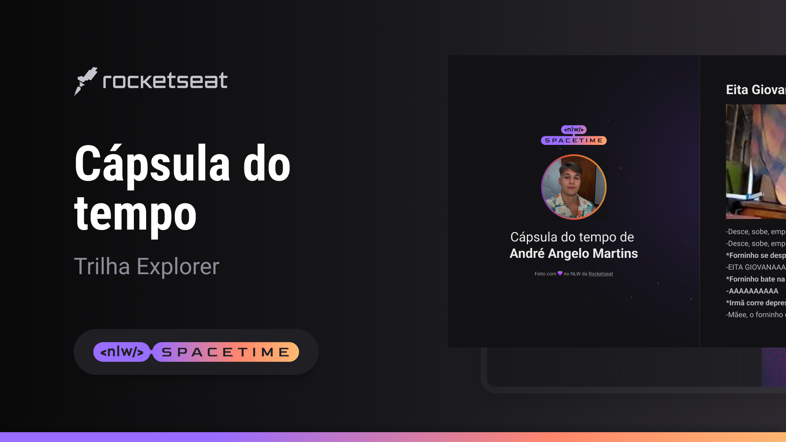

  

  ## 🚧 Projeto
  Esse é um projeto Web Responsivo de uma cápsula do tempo para visualizar memes antigos.

  ## 💻 Tecnologias
  O projeto foi desenvolvido durante um curso de programação organizado pela Rocketseat com as seguintes tecnologias:

  - HTML
  - CSS
  - Git e GitHub

  ## 🎨 Layout
  Você pode visualizar o layout do projeto através
  [desse link](https://www.figma.com/community/file/1240071097028170811/C%C3%A1psula-do-tempo-%E2%80%A2-Trilha-Explorer).
  É necessário ter uma conta no [Figma](https://www.figma.com)